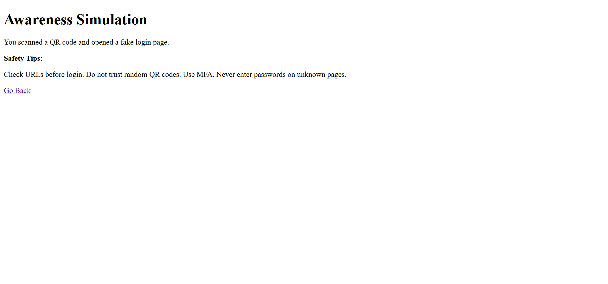
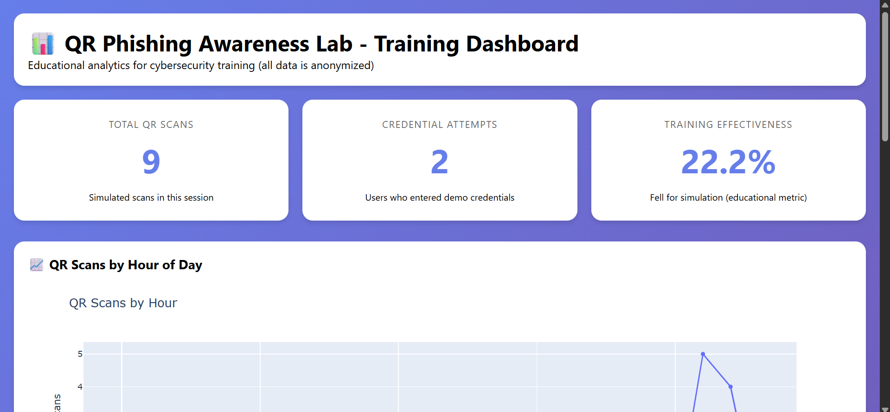

Replace your current `README.md` with this upgraded version 🚀

````md
# 🛡️ QR Phishing Awareness Lab 2.0

A modern cybersecurity awareness and training platform demonstrating how QR-code phishing attacks, also known as **Quishing**, can trick users into visiting fake login pages.

Built for:
- Cybersecurity education
- Awareness training
- Defensive research
- Ethical security demonstrations

⚠️ Educational use only. No real credentials are stored.

---

# 🚀 Features

## 🔍 QR Risk Scanner
Analyze suspicious QR-code URLs and detect phishing indicators.

## 📊 Analytics Dashboard
Interactive dashboard with:
- QR scan tracking
- Credential attempt statistics
- Risk metrics
- Visual charts using Plotly

## 📱 Mobile Responsive
Fully responsive design for:
- Mobile devices
- Tablets
- Desktop systems

## 🛡️ Phishing Detection Engine
Detects:
- Typosquatting
- URL shorteners
- Suspicious domains
- Excessive subdomains
- Risk keywords

## 📚 Security Training Module
Includes:
- Educational material
- Real-world phishing examples
- Security awareness quiz
- Prevention techniques

## 🐳 Docker Support
Containerized deployment using Docker & Docker Compose.

---

# 🏗️ Project Structure

```text
qr-phishing-awareness-lab/
│
├── analytics/
├── logs/
│
├── static/
│   ├── css/
│   │   └── style.css
│   ├── js/
│   └── img/
│       └── qr-demo.png
│
├── templates/
│   ├── index.html
│   ├── warning.html
│   ├── dashboard.html
│   └── training.html
│
├── app.py
├── generate_sample_qr.py
├── requirements.txt
├── Dockerfile
├── docker-compose.yml
└── README.md
````

---

# ⚡ Technologies Used

* Python
* Flask
* HTML5
* CSS3
* JavaScript
* Plotly
* QRCode Library
* Docker
* Git & GitHub

---

# 📸 Screenshots

## 🏠 Main Awareness Portal


---

## ⚠️ Security Warning Page



---

## 📊 Analytics Dashboard



---

## 🔳 QR Code Demo


---

# 🧪 Installation

## 1️⃣ Clone Repository

```bash
git clone https://github.com/shaan150406-svg/qr-phishing-awareness-lab.git
cd qr-phishing-awareness-lab
```

---

## 2️⃣ Install Dependencies

```bash
pip install -r requirements.txt
```

---

## 3️⃣ Generate QR Code

```bash
python generate_sample_qr.py
```

---

## 4️⃣ Run Application

```bash
python app.py
```

---

# 🌐 Access URLs

| Feature         | URL                                                                                |
| --------------- | ---------------------------------------------------------------------------------- |
| Main Lab        | [http://localhost:5000](http://localhost:5000)                                     |
| Dashboard       | [http://localhost:5000/admin/dashboard](http://localhost:5000/admin/dashboard)     |
| Training Module | [http://localhost:5000/training-material](http://localhost:5000/training-material) |

---

# 📱 Mobile Testing

1. Connect laptop and phone to same Wi-Fi
2. Find your local IP:

```bash
ipconfig
```

3. Update QR URL inside:

```python
generate_sample_qr.py
```

Example:

```python
url = "http://192.168.1.5:5000/qr-login"
```

4. Regenerate QR code

```bash
python generate_sample_qr.py
```

5. Scan QR from phone

---

# 🐳 Docker Deployment

## Run with Docker Compose

```bash
docker-compose up --build
```

---

# 📚 Educational Topics Covered

* QR phishing attacks
* Social engineering
* URL inspection
* Credential phishing
* Mobile security
* Awareness training
* QR tampering detection
* Safe browsing practices

---

# ⚠️ Security Disclaimer

This project is strictly for:

* Educational purposes
* Ethical cybersecurity training
* Defensive awareness demonstrations

Do NOT use this project against:

* Real users
* Public systems
* Organizations
* Networks without authorization

The author is not responsible for misuse.

---

# 🚀 Future Improvements

* Real-time analytics
* SIEM integration
* AI phishing detection
* Heatmap visualization
* Admin authentication
* API rate limiting
* Cloud deployment
* Threat intelligence feeds

---

# 👨‍💻 Author

**Shaan**
Aspiring Cybersecurity Enthusiast 🛡️

GitHub:
[https://github.com/shaan150406-svg](https://github.com/shaan150406-svg)

---

# ⭐ Support

If you found this project useful:

* Star the repository
* Share with friends
* Use it for awareness training
* Contribute improvements

````
